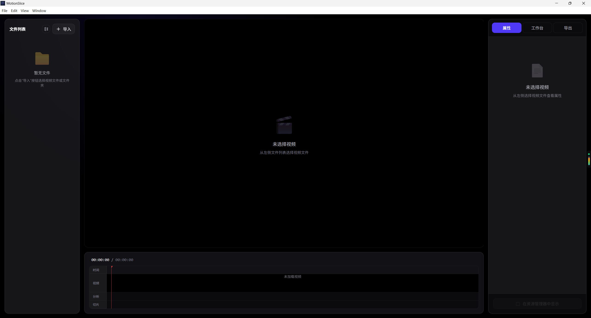
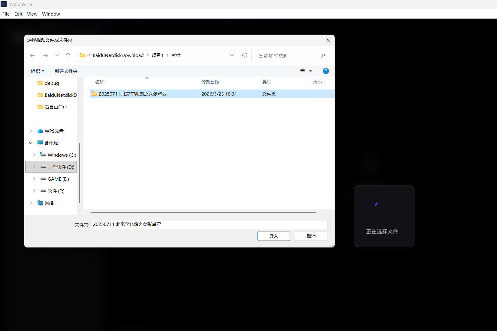
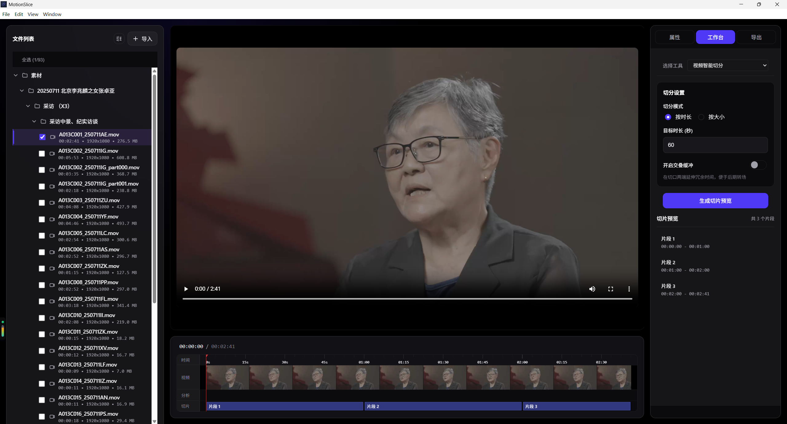
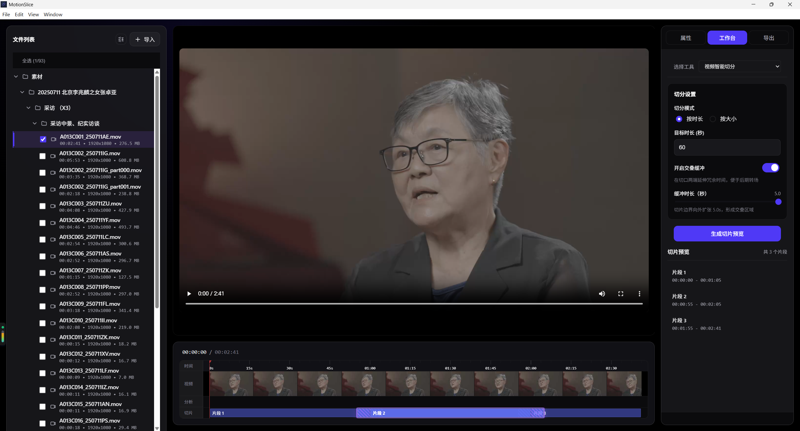
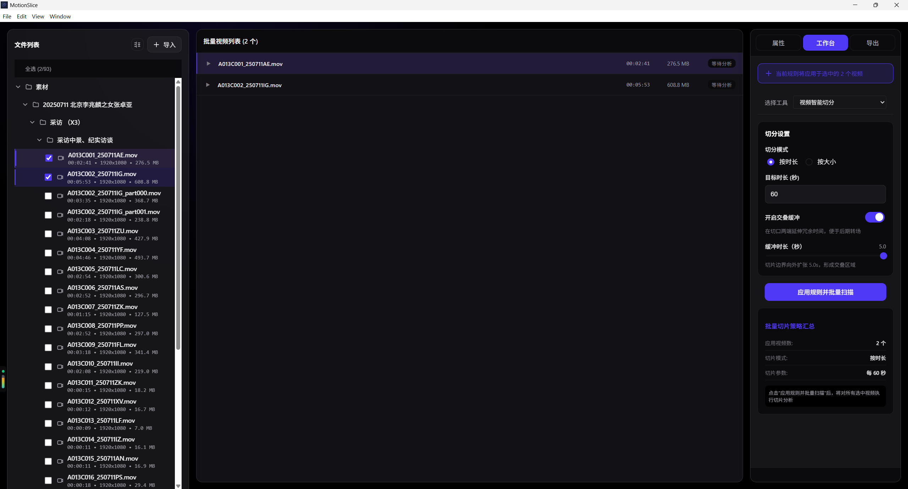
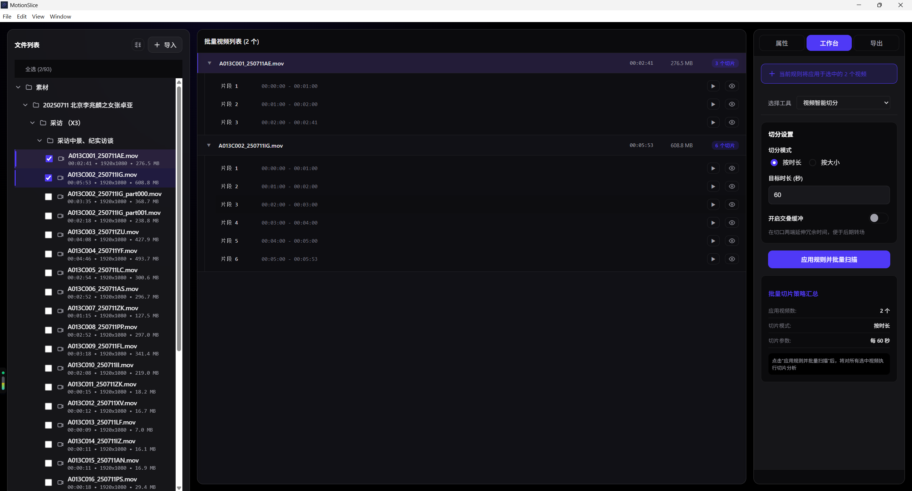
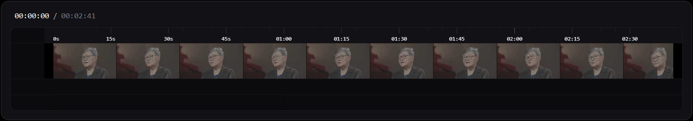
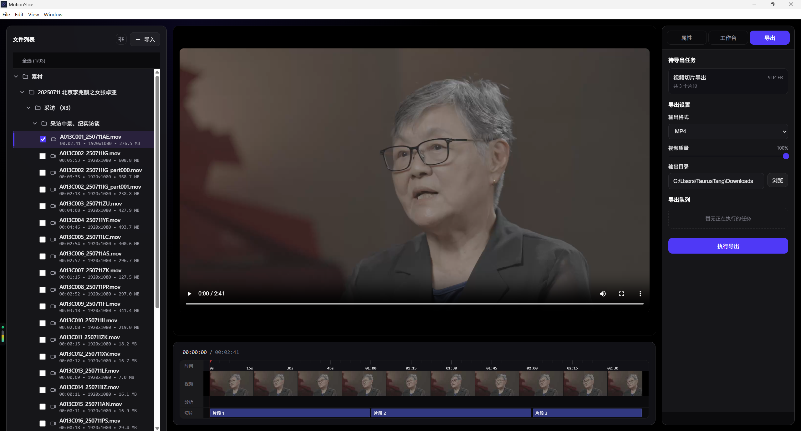
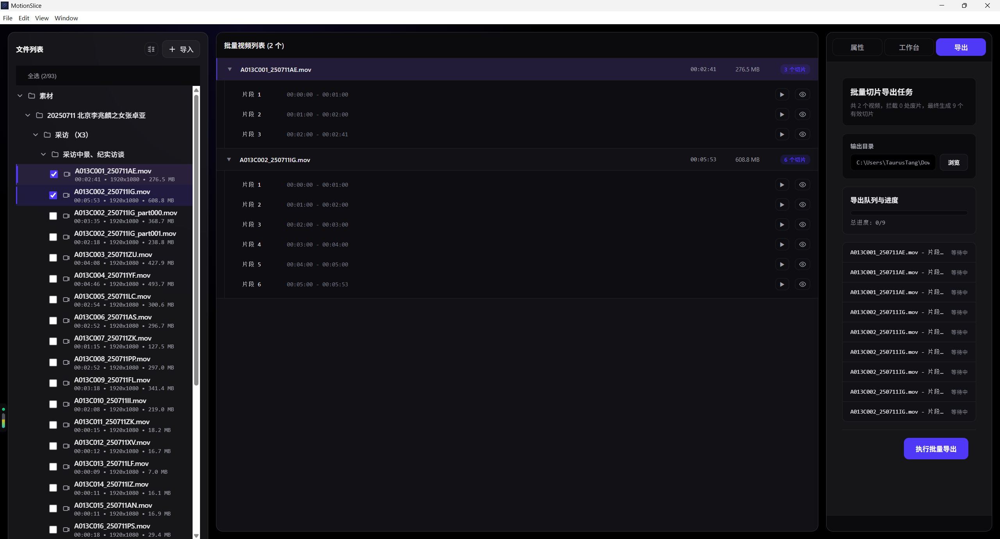
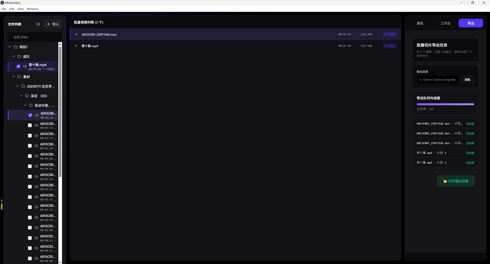

# MotionSlice 操作手册

> 视频智能切片与导出工具 - 让视频剪辑更高效

---

## 目录

- [快速开始](#快速开始)
- [界面概览](#界面概览)
- [核心功能](#核心功能)
  - [1. 导入视频](#1-导入视频)
  - [2. 配置切片参数](#2-配置切片参数)
  - [3. 批量模式](#3-批量模式)
  - [4. 时间轴预览](#4-时间轴预览)
  - [5. 导出](#5-导出)
- [进阶技巧](#进阶技巧)
- [常见问题](#常见问题)

---

## 快速开始

### 安装与启动

1. **下载安装包**
   - Windows: `MotionSlice-Setup.exe`
   - macOS: `MotionSlice.dmg`

2. **首次启动**
   - Windows/Linux: 双击应用图标
   - macOS: 拖拽到应用程序文件夹后启动

3. **系统要求**
   - 操作系统：Windows 10+, macOS 10.13+, Ubuntu 18.04+
   - 内存：建议 4GB 以上
   - 磁盘空间：100MB（不含视频文件）

---

## 界面概览

MotionSlice 采用专业视频工作台布局，主要分为四个区域：



### 区域说明

1. **左侧文件列表**
   - 导入的视频文件列表
   - 显示文件名、时长、大小等信息
   - 支持单选/多选模式切换

2. **中间预览区**
   - 视频播放器（黑色舞台）
   - 底部时间轴轨道（可视化切片）
   - 播放控制条（播放/暂停、进度拖动）

3. **右侧工作区**（三个标签页切换）
   - **属性**：视频信息展示
   - **工作台**：切片参数配置和切片列表
   - **导出**：导出队列和任务进度监控

---

## 核心功能

### 1. 导入视频

1. 点击左侧工作台的 **"选择视频文件"** 按钮
2. 在系统文件选择器中选择视频文件
3. 支持格式：MP4, MOV, AVI, MKV 等常见格式




#### 视频信息展示

导入成功后，左侧列表会显示：
- 视频文件名
- 时长（如 `01:23:45`）
- 文件大小（如 `1.2 GB`）
- 分辨率（如 `1920x1080`）

---

### 2. 配置切片参数

在右侧切片设置面板中配置切分规则：



#### 2.1 切分模式

**按时长切分**
- 适用场景：固定时长的短视频批量生产
- 参数设置：输入目标时长（秒），如 `60` 表示每 60 秒切一段
- 示例：90 分钟的视频按 60 秒切分，生成 90 个片段

**按大小切分**
- 适用场景：平台有文件大小限制
- 参数设置：输入目标大小（MB），如 `50` 表示每段约 50MB
- 注意：实际大小受视频码率影响，会有 ±10% 的浮动

#### 2.2 交叠缓冲（Overlap Handles）



**什么是交叠缓冲？**

在每个切片的首尾额外保留一段冗余时间，避免机械切分导致语义不完整。

**核心作用**：
- ✅ **防止语义断裂**：避免人物说话被切断到一半，导致素材无法使用
- ✅ **保留完整镜头**：确保动作、表情、对话的起承转合不被打断
- ✅ **后期调整空间**：为添加转场效果（淡入淡出、溶解等）预留时间

**使用场景**：
- ✅ 对话类视频（访谈、教学、Vlog）— **强烈推荐开启**
- ✅ 需要在切片间添加转场效果
- ✅ 担心切分点不够精准，需要手动微调
- ❌ 纯音乐、风景等无对话内容，且不需要后期处理

**参数说明**：
- 缓冲时长：0.0 - 5.0 秒（推荐 1.0 - 2.0 秒）
- 效果：切片时间范围向外扩张，例如原本 `10s-70s` 的片段会变成 `9s-71s`（缓冲 1 秒时）

**时间轴显示**：
- 实色区域：原始切片范围
- 斜纹区域：交叠缓冲扩张部分

**实际案例**：
```
❌ 不开启缓冲：
片段 1 结束："今天我要教大家如何..."（被切断）
片段 2 开始："...制作视频切片。"（缺少上文）

✅ 开启 1.5 秒缓冲：
片段 1 结束："今天我要教大家如何制作视频切片。接下来..."
片段 2 开始："...今天我要教大家如何制作视频切片。接下来我们先..."
（两个片段都保留了完整的句子，后期可以精确选择切入点）
```

---

### 3. 批量模式

前面介绍的都是**单选模式**（一次处理一个视频，可实时预览和调整）。当你需要用相同规则批量处理多个视频时，可以切换到**批量模式**。



#### 3.1 批量模式特性

**适用场景**：
- 多个视频使用相同切分规则
- 批量生产大量短视频
- 不需要逐个预览，追求效率

**核心能力**：
- ✅ 同时选择多个视频
- ✅ 统一应用切分参数
- ✅ 一键生成所有切片
- ✅ 支持选择性禁用某些切片（逐个勾选导出）

#### 3.2 批量模式操作流程



1. **批量导入**：连续点击"+ 导入"按钮，选择多个视频文件
2. **配置参数**：在右侧工作台设置切分规则（所有视频共用）
3. **生成切片**：点击 **"批量分析"** 按钮
4. **管理切片**：
   - 左侧列表按视频分组显示所有切片
   - 每个切片有独立的勾选框（用于选择性导出）
   - 可展开/折叠视频组
5. **批量导出**：点击 **"全部加入队列"** 按钮

#### 3.3 单选模式 vs 批量模式

| 功能特性         | 单选模式 | 批量模式 |
|------------------|----------|----------|
| 同时处理视频数   | 1 个     | 多个     |
| 时间轴可视化     | ✅       | ❌       |
| 播放器预览       | ✅       | ❌       |
| 三向联动         | ✅       | ❌       |
| 切片选择性导出   | 全部导出 | 逐个勾选 |
| 处理效率         | 精细     | 快速     |
| 适合场景         | 单视频精剪 | 批量生产 |

**切换注意事项**：
- 切换模式时，未导出的切片预览会被清空
- 已加入导出队列的任务不受影响
- 建议在开始工作前确定使用哪种模式

---

### 4. 时间轴预览

时间轴是单选模式的核心可视化组件，提供直观的切片预览和交互能力。



#### 4.1 时间轴元素

1. **时间刻度尺**
   - 顶部显示视频总时长刻度
   - 自动根据缩放比例调整刻度密度

2. **切片块（Clip）**
   - 紫蓝色矩形表示切片范围
   - 实色区域：原始切片时间
   - 斜纹区域：交叠缓冲扩张部分
   - 悬停显示详细信息（起止时间、时长）

3. **播放游标（Playhead）**
   - 红色细线 + 顶部三角形指示器
   - 显示当前播放位置
   - 拖动游标跳转到指定时间

4. **选中状态**
   - 点击切片块高亮显示（紫色描边 + 微光晕）
   - 左侧列表同步滚动到对应项

#### 4.2 交互操作

| 操作             | 触发方式                     | 效果                       |
|------------------|------------------------------|----------------------------|
| 跳转到切片       | 点击时间轴切片块             | 播放器跳转 + 切片高亮      |
| 精确定位         | 拖动播放游标                 | 播放器实时跟随             |
| 查看切片详情     | 悬停在切片块上               | Tooltip 显示起止时间       |
| 同步列表         | 点击左侧切片列表项           | 时间轴自动滚动并高亮       |

---

### 5. 导出

所有切片任务统一通过右侧导出面板管理，支持批量执行和进度监控。

#### 5.1 添加导出任务



**单选模式**：
- 点击 **"执行导出"** 按钮
- 当前视频的所有切片添加到队列


**批量模式**：
- 勾选需要导出的切片
- 点击 **"执行批量导出"** 按钮
- 仅选中的切片添加到队列

#### 5.2 导出配置

在开始导出前，需要配置输出参数：


| 参数         | 说明                                           | 推荐值            |
|--------------|------------------------------------------------|-------------------|
| 输出目录     | 切片文件保存位置（点击选择系统文件夹）         | 桌面或专用文件夹  |
| 输出格式     | 视频容器格式：MP4（推荐）/ MOV / AVI           | MP4               |
| 视频质量     | 10-100，100 为无损拷贝（不重新编码）           | 100（无损）       |

**质量说明**：
- **100（无损）**：直接拷贝原始视频流，速度快，文件大
- **80-99**：轻微压缩，兼顾质量和大小
- **60-79**：标准压缩，适合网络分发
- **10-59**：高压缩，文件小但质量下降

#### 5.3 执行导出

1. 点击 **"执行导出"/"执行批量导出"** 按钮
2. 任务队列按顺序执行
3. 实时显示：
   - 当前处理的切片名称
   - 进度百分比（如 `3/12`）
   - 任务状态（处理中、成功、失败）



#### 5.4 导出结果

**成功**：
- 队列项显示绿色 "已完成" 标记
- 点击 **"打开输出目录"** 查看文件

**失败**：
- 队列项显示红色错误图标
- 点击查看错误详情
- 控制台打印完整技术日志

**文件命名规则**：
```
{原视频名}_{切片标签}.{格式}
例如：婚礼视频_片段 1.mp4
```

---

## 进阶技巧

### 技巧 1：快速预估切片数量

**按时长切分**：
```
切片数量 ≈ 视频总时长（秒） / 目标时长（秒）
例如：3600 秒视频 ÷ 60 秒 = 60 个片段
```

**按大小切分**：
```
切片数量 ≈ 视频文件大小（MB） / 目标大小（MB）
例如：1200 MB 视频 ÷ 50 MB = 24 个片段
```

### 技巧 2：交叠缓冲的最佳实践

- **纯拆分场景**：关闭交叠缓冲，节省磁盘空间
- **需要转场**：开启 1-2 秒缓冲，覆盖常见转场时长
- **专业剪辑**：开启 3-5 秒缓冲，预留更大调整空间

### 技巧 3：无损导出的性能优化

- 质量设置为 100 时，使用 **流拷贝（Stream Copy）** 技术
- 不重新编码，速度提升 10-50 倍
- 输出文件与原视频质量完全一致

### 技巧 4：批量模式的选择性导出

在批量模式中，可以：
1. 取消勾选不需要的切片
2. 仅导出精选片段，节省时间
3. 后续可以随时补充导出未选中的切片

---

## 常见问题

### Q1: 导出失败提示"文件被占用"怎么办？

**原因**：目标文件正在被其他程序使用（如播放器、剪辑软件）。

**解决方案**：
1. 关闭所有打开该文件的程序
2. 或修改输出目录到新位置
3. 重新执行导出

### Q2: 按大小切分的文件为什么不精确？

**原因**：视频码率不是恒定的（动态码率 VBR），不同片段的压缩比不同。

**说明**：
- 实际文件大小会有 ±10% 的浮动
- 动作密集的片段（如打斗场景）通常会更大
- 静止画面的片段（如风景镜头）通常会更小

### Q3: 时间轴上的斜纹区域是什么？

**答案**：交叠缓冲的扩张区域。

- 实色部分：原始切片时间范围
- 斜纹部分：向外扩张的冗余时间
- 关闭交叠缓冲后，斜纹消失

### Q4: macOS 上关闭窗口后应用还在运行？

**答案**：这是 macOS 的标准行为，不是 Bug。

- 点击红色关闭按钮 → 窗口隐藏，应用保持运行
- 点击 Dock 图标 → 重新显示窗口
- 按 `Cmd+Q` → 完全退出应用

### Q5: 单选模式和批量模式可以切换吗？

**答案**：可以，但会清空当前状态。

- 切换模式时，未导出的切片预览会被清空
- 已加入导出队列的任务不受影响
- 建议在开始工作前确定使用哪种模式

### Q6: 支持哪些视频格式？

**输入格式**：
- 常见格式：MP4, MOV, AVI, MKV, FLV, WMV, WEBM
- 编码要求：H.264, H.265, VP9 等主流编码

**输出格式**：
- MP4（推荐，兼容性最好）
- MOV（适合 macOS 生态）
- AVI（适合传统剪辑软件）

### Q7: 导出质量 100 和 80 的区别？

| 质量设置 | 编码方式   | 速度     | 文件大小 | 画质     |
|----------|------------|----------|----------|----------|
| 100      | 流拷贝     | 极快     | 最大     | 无损     |
| 80-99    | 轻微重编码 | 较快     | 略小     | 肉眼无差 |
| 60-79    | 标准重编码 | 中等     | 中等     | 轻微损失 |
| 10-59    | 高压缩     | 较慢     | 最小     | 明显损失 |

---

## 快捷键参考

| 快捷键       | 功能                     | 适用范围 |
|--------------|--------------------------|----------|
| `Space`      | 播放/暂停                | 播放器   |
| `Left/Right` | 逐帧前进/后退（0.1 秒）  | 播放器   |

---

**版本**: v0.0.2
**最后更新**: 2026-06-23
