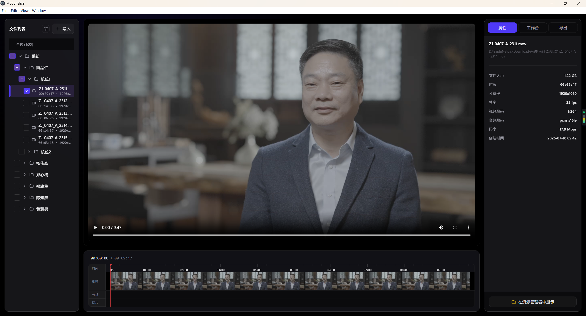
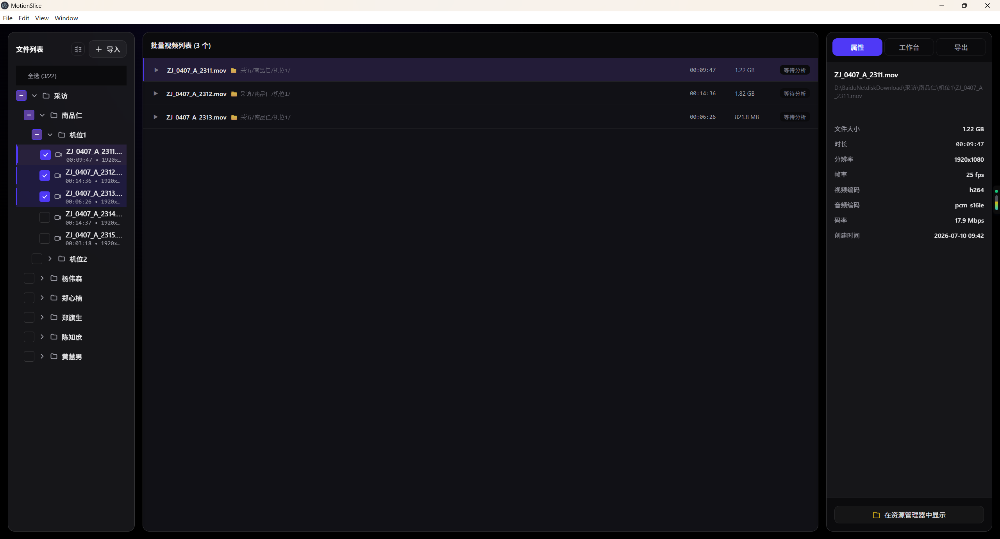
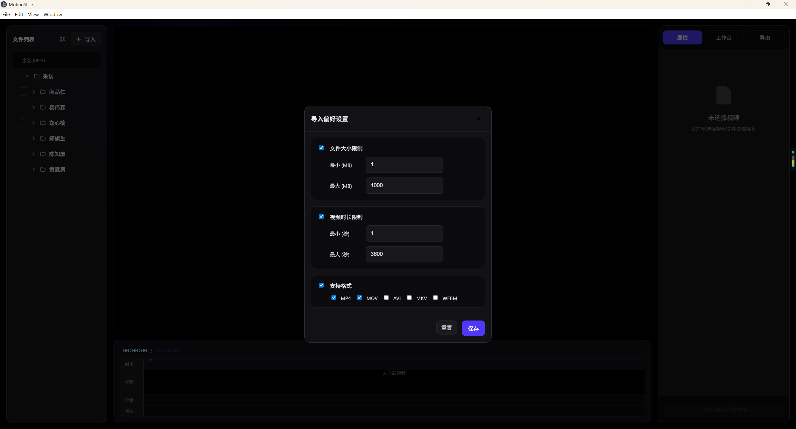
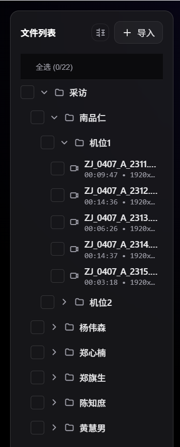
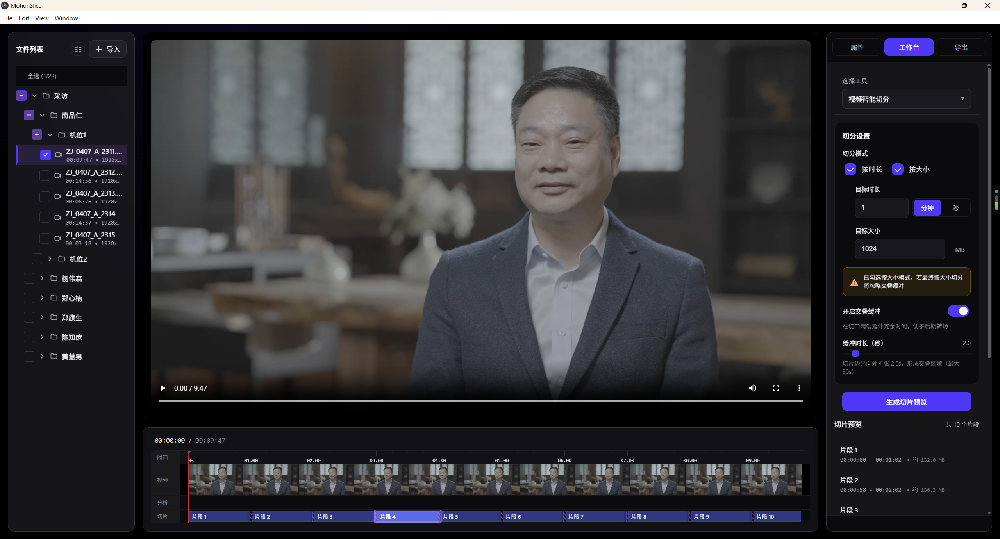
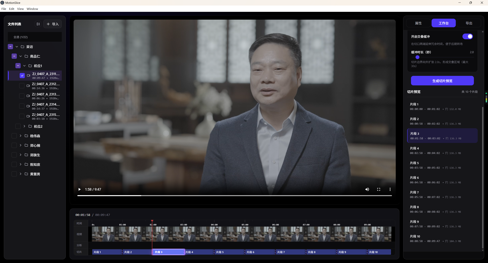
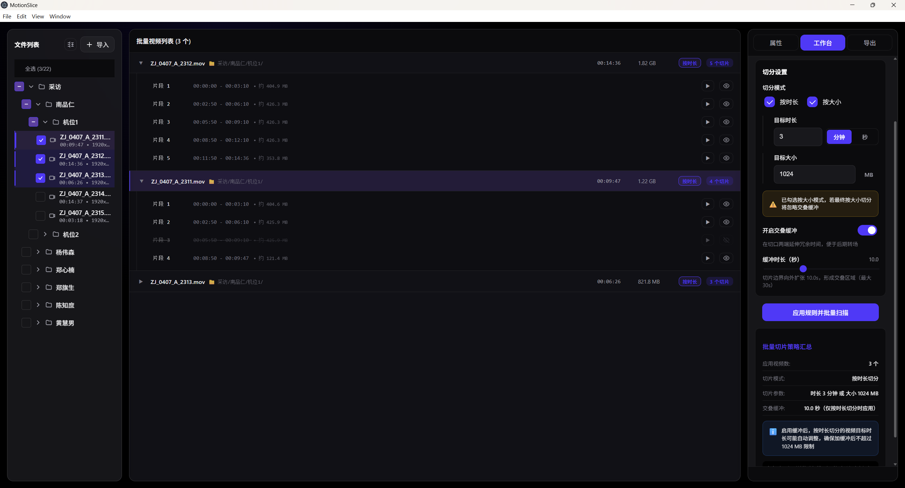
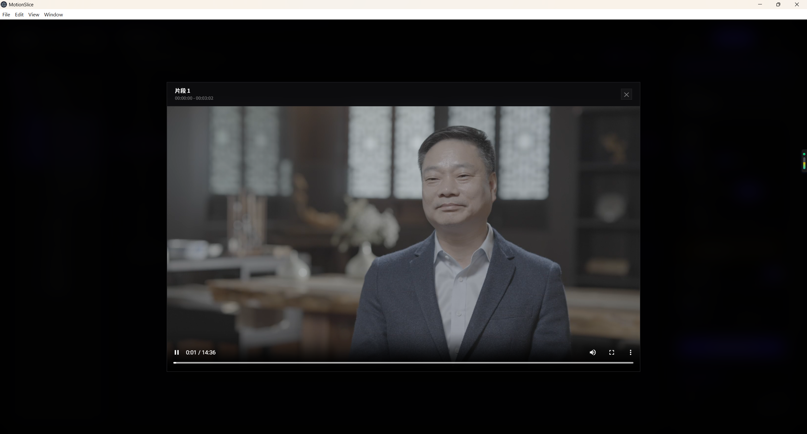
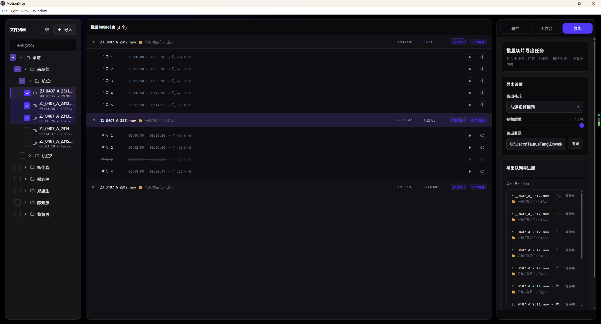
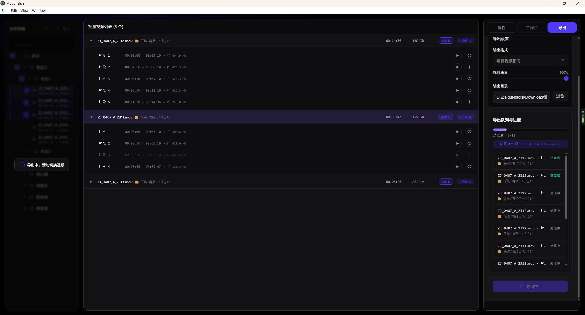

# MotionSlice 用户指南

> 适用版本：v0.0.8
>
> 最后更新：2026-07-24

MotionSlice 是一款桌面端视频切片与批量导出工具。当前版本支持按时长、按文件大小或同时使用两项条件生成切片，并可在导出时保留多音轨。界面中的「分析」轨道目前为预留区域，尚未提供晃动片段识别功能。

## 目录

- [快速开始](#快速开始)
- [安装与运行](#安装与运行)
- [界面与选择逻辑](#界面与选择逻辑)
- [导入视频](#导入视频)
- [查看视频属性](#查看视频属性)
- [配置切片规则](#配置切片规则)
- [单视频工作流](#单视频工作流)
- [批量工作流](#批量工作流)
- [导出切片](#导出切片)
- [常见问题](#常见问题)

## 快速开始

完成一次切片导出只需以下步骤：

1. 点击左侧「导入」，选择一个视频文件或一个包含视频的文件夹。
2. 在左侧文件树中勾选视频。勾选 1 个视频时进入单视频视图；勾选多个视频时自动进入批量视图。
3. 打开右侧「工作台」，设置切片条件，然后点击「生成切片预览」或「应用规则并批量扫描」。
4. 检查生成的切片。批量视图中可预览片段，并排除不需要导出的片段。
5. 打开右侧「导出」，确认格式、质量和输出目录，然后执行导出。
6. 全部完成后点击「打开输出目录」查看结果。



## 安装与运行

当前发布流程提供以下安装包：

- Windows x64：`.exe` 安装包。
- macOS Apple 芯片：ARM64 `.dmg` 安装包。
- macOS Intel 芯片：x64 `.dmg` 安装包。

Windows 用户运行安装包后按系统提示完成安装。macOS 用户打开 `.dmg`，将 MotionSlice 拖入「应用程序」目录后启动。

MotionSlice 内置视频分析与导出组件，无需单独安装 FFmpeg。视频处理会占用额外磁盘空间，建议将输出目录放在空间充足的磁盘。

## 界面与选择逻辑

### 界面布局

应用采用三栏工作台布局：

| 区域 | 用途 |
|---|---|
| 左侧「文件列表」 | 导入素材、展开目录、勾选视频、全选素材、设置导入偏好 |
| 中间工作区 | 单视频时显示播放器与时间轴；多视频时显示批量视频及切片列表 |
| 右侧检查器 | 通过「属性」「工作台」「导出」3 个标签页查看信息、配置规则和执行导出 |

可拖动左侧面板右边缘调整文件列表宽度。

### 单视频与批量视图

MotionSlice 根据已勾选的视频数量自动切换视图，没有单独的模式开关。

| 已勾选数量 | 当前视图 | 主要能力 |
|---:|---|---|
| 0 | 空状态 | 等待选择视频 |
| 1 | 单视频视图 | 播放视频、查看时间轴、生成并联动预览切片 |
| 2 个及以上 | 批量视图 | 统一应用规则、展开每个视频的切片、逐段预览和排除废片 |

需要注意：从单视频切换到批量视图，或从批量视图回到单视频视图时，已经生成的切片结果和对应导出任务会被清理。切片参数及导出设置在标签页切换期间会保留，但关闭并重新启动应用后会恢复默认值。

### 行点击与复选框的区别

- 点击视频所在的整行：只选择该视频，并进入单视频视图。
- 点击视频前的复选框：在当前选择中添加或移除该视频，适合多选。
- 点击目录前的复选框：选择或取消该目录下的全部视频；半选状态显示横线。
- 点击「全选」：选择或取消当前文件树中的全部视频。
- 在批量列表中点击某个视频行：只改变右侧「属性」页展示的对象，不会取消其他已选视频。



## 导入视频

### 设置导入偏好

点击「导入」左侧的设置按钮可打开「导入偏好设置」。规则会在扫描时组合使用，未通过任一已启用规则的视频会被过滤。

| 规则 | 可配置内容 | 默认状态 |
|---|---|---|
| 文件大小限制 | 最小值和最大值，单位为 MB | 关闭，默认范围为 1～1000 MB |
| 视频时长限制 | 最小值和最大值，单位为秒 | 关闭，默认范围为 1～3600 秒 |
| 支持格式 | MP4、MOV、AVI、MKV、WEBM | 开启，默认只勾选 MP4 和 MOV |

点击「重置」会恢复上述默认值；点击「保存」后，设置用于下一次导入。



### 选择文件或文件夹

1. 点击左侧「导入」。
2. 在系统选择器中选择一个或多个视频文件、文件夹，也可以混合选择。
3. 点击「导入」后等待扫描和元数据解析完成。

目录会被递归扫描。扫描器可识别 MP4、MOV、AVI、MKV、WEBM、FLV 和 WMV；如果启用了格式过滤，则最终只保留偏好设置中勾选的格式。当前偏好设置界面未提供 FLV 和 WMV 选项，如需导入这两种格式，应关闭「支持格式」过滤。

导入期间会依次显示「正在选择文件」「正在扫描并解析视频」「正在重置工作区并更新文件」等状态。扫描完成后，文件树会显示视频的时长、分辨率和文件大小。

> **重要：** 成功选择并扫描新素材后，当前文件树、选择状态、切片结果和导出队列会被新导入内容替换。若在系统选择器中取消，本次操作不会改变已有工作区。



## 查看视频属性

选择视频后，右侧「属性」页会展示：

- 文件名与完整路径；
- 文件大小、时长和分辨率；
- 帧率、视频编码和音频编码；
- 总码率与文件创建时间。

点击底部「在资源管理器中显示」可在系统文件管理器中定位源文件。在批量视图中，点击中间列表中的某个视频行，可查看该视频的属性而不改变批量选择。

## 配置切片规则

打开右侧「工作台」，当前可用工具为「视频智能切分」。

### 切分条件

「按时长」和「按大小」使用复选框控制，至少要保留一种条件。

| 条件 | 设置方式 | 适用场景 |
|---|---|---|
| 按时长 | 输入目标值，并选择「分钟」或「秒」 | 需要固定时长片段，例如短视频生产 |
| 按大小 | 输入目标大小，单位为 MB | 上传平台或交付标准限制单文件大小 |
| 两者同时启用 | 分别设置时长和大小 | 任一条件先达到就切分，避免片段过长或过大 |

默认配置为：按时长和按大小同时启用、目标时长 20 分钟、目标大小 1024 MB、交叠缓冲关闭。

按大小切分依据源视频的平均码率换算时间点。可变码率视频各段复杂度不同，因此列表中的预估大小和最终文件大小都可能与目标值存在偏差。

如果视频同时没有超过目标时长和目标大小，MotionSlice 仍会生成 1 个覆盖完整视频的片段；批量列表中会标记为「无需切分」。

### 交叠缓冲

交叠缓冲会把按时长生成的每个逻辑片段向前、向后扩展一段时间，为后期剪辑和转场保留余量。范围为 0.0～30.0 秒。

例如，逻辑片段为 `00:01:00～00:02:00`，缓冲设置为 2 秒，则实际导出范围为 `00:00:58～00:02:02`；视频首尾处会自动限制在有效范围内。

使用限制如下：

- 仅启用「按大小」时，交叠缓冲不可用。
- 同时启用两种条件时，若某个视频最终按大小切分，该视频不会应用缓冲。
- 同时启用两种条件且最终按时长切分时，系统可能缩短核心片段时长，避免加入首尾缓冲后超过大小限制。
- 时间轴切片中的斜纹区域表示实际加入的头部或尾部缓冲。



## 单视频工作流

### 生成切片预览

1. 在左侧只选择 1 个视频。
2. 打开「工作台」并配置切片规则。
3. 点击「生成切片预览」。
4. 在右侧「切片预览」列表核对片段数量、起止时间和预估大小。

点击列表中的片段会选中对应切片，并把播放器跳转到该片段的开始位置。

### 使用播放器与时间轴

中间工作区顶部为系统视频播放器，可通过播放器自带控件播放、暂停、调整音量或拖动播放进度。底部时间轴包含 4 条轨道：

| 轨道 | 内容 |
|---|---|
| 时间 | 根据视频总时长自动生成的刻度 |
| 视频 | 自动抽取的视频缩略图 |
| 分析 | 预留轨道，当前版本没有分析标记 |
| 切片 | 生成的切片范围及交叠缓冲 |

时间轴支持以下操作：

- 点击时间轴任意有效位置，将播放器跳转到对应时间。
- 点击切片块，选中该片段并跳转到片段起点。
- 播放视频时，红色播放指针会同步移动。
- 点击右侧切片预览项时，时间轴中的对应切片会同步高亮。



## 批量工作流

### 进入批量视图

通过视频复选框、目录复选框或「全选」选择至少 2 个视频。中间播放器和时间轴会自动替换为「批量视频列表」，右侧工作台会提示当前规则将应用于多少个视频。

### 批量分析

1. 在「工作台」设置共用规则。
2. 检查「批量切片策略汇总」中的视频数、切片条件和缓冲信息。
3. 点击「应用规则并批量扫描」。
4. 等待每个视频的状态由「等待分析」更新为切片数量。

同时启用两种条件时，不同视频可能因时长、大小和平均码率不同而采用不同的实际模式。列表中的「按时长」「按大小」或「无需切分」标签表示该视频最终采用的策略。

### 检查和筛选片段

- 点击视频行左侧的箭头，展开或折叠切片列表。
- 点击片段右侧的播放按钮，在弹窗中预览该片段；播放到片段结束位置后会暂停并回到片段起点。预览能力依赖 Electron 内置的 Chromium 媒体支持，部分容器或编码格式可能无法播放。
- 点击片段右侧的眼睛按钮可启用或排除该片段。被排除的片段会变暗并显示删除线，不会进入导出队列。
- 点击视频行可在右侧「属性」页查看对应视频信息。

重新执行批量扫描会替换之前的批量切片结果，并清空旧的执行队列。





## 导出切片

生成切片后，打开右侧「导出」页。单视频视图显示当前视频的全部片段；批量视图只统计并显示仍处于启用状态的片段。

### 导出设置

| 参数 | 说明 | 默认值 |
|---|---|---|
| 输出格式 | 与源视频相同、MP4、MOV 或 AVI | 与源视频相同 |
| 视频质量 | 10%～100%，以 10% 为步长 | 100% |
| 输出目录 | 切片保存位置，可点击「浏览」修改 | 用户主目录下的 `Downloads` 文件夹 |

建议优先使用「与源视频相同」和 100% 质量。这样通常只进行时间裁剪，不重新编码视频和音频，速度最快，也能减少容器与编码不兼容的问题。

#### 格式与质量规则

- 质量为 100% 时，所有已映射的流使用流拷贝，不重新编码。流拷贝受源视频关键帧位置影响，实际切点可能与预览时间存在轻微偏差。
- 质量低于 100% 时，视频会编码为 H.264，音频会编码为 AAC 128 Kbps。
- 输出为 MP4 时会保留全部视频流和音频流，但不会映射字幕、时间码等其他流。
- 输出为 MOV 或 AVI 时会映射全部流；压缩导出时会尝试直接复制字幕和数据流。
- 多音轨源视频会保留全部音频轨道，而不是只保留第 1 条。



### 执行与查看进度

1. 确认输出目录有效且有足够空间。
2. 单视频点击「执行导出」，批量视图点击「执行批量导出」。
3. 查看总进度、当前处理片段和各任务状态。
4. 全部成功后点击「打开输出目录」。

导出期间，左侧文件列表和右侧工作台会被锁定，不能导入或切换视频。属性和导出页仍可查看。

批量导出采用容错执行方式：某个视频或片段失败后，应用会继续处理后续任务。结束时失败项会标为「失败」，错误面板会汇总原因；已经成功的文件会保留。



### 文件命名与目录结构

导出文件名使用以下格式：

```text
{源视频文件名（不含扩展名）}_{片段标签}.{输出格式}
```

例如：

```text
访谈素材_片段 1.mov
访谈素材_片段 2.mov
```

直接选择单个文件时，结果保存在所选输出目录。通过目录导入并选择目录内视频时，导出会在输出目录中保留所选根目录及其子目录层级，便于批量素材按原结构归档。

若同名目标文件已经存在，导出可能失败。重新执行前可更换输出目录，或先处理已有同名文件。

## 常见问题

### 为什么勾选第 2 个视频后，播放器和时间轴消失了？

这是正常的自动视图切换。选择 1 个视频时显示单视频播放器和时间轴；选择 2 个及以上视频时改为批量列表。取消多余勾选，只保留 1 个视频即可回到单视频视图。

### 为什么切换选择后，之前生成的切片不见了？

切片结果与当前选择绑定。单视频之间切换、单视频与批量视图互相切换，都会清理不再适用的切片和导出任务。切换右侧「属性」「工作台」「导出」标签页不会重置配置。

### 为什么只启用按大小时不能开启交叠缓冲？

缓冲会增加片段时长和文件大小，使大小目标失去约束意义。因此最终按大小切分的片段不应用缓冲。需要缓冲时，请启用按时长条件；也可同时启用两种条件，让系统按先达到的条件决定。

### 为什么按大小切分的结果不是精确的目标大小？

MotionSlice 使用源文件总大小和总时长计算平均码率，再据此估算切点。可变码率视频在不同画面中的实际码率不同，因此目标大小、预估大小和最终输出大小可能存在差异。

### 为什么视频可以分析和导出，却不能在播放器中预览？

分析和导出使用 FFmpeg/FFprobe，单视频播放器、时间轴缩略图和批量片段预览弹窗则依赖 Electron 内置的 Chromium 媒体能力。某些 MKV、AVI、WEBM 容器，以及 H.265/HEVC、ProRes 或部分 AV1 编码的视频，可能可以分析和导出，但无法直接播放或生成缩略图。可先将素材转为 MP4 容器的 H.264 视频，或在不依赖画面预览的情况下按元数据切分。

### 为什么 100% 质量导出的切点与预览时间有轻微偏差？

100% 质量使用流拷贝，不会重新编码视频。由于多数视频只能从关键帧处开始解码，实际文件的起止位置可能与设定时间存在轻微偏差。若需要更精确的切点，可将质量调到 100% 以下，让视频重新编码。

### 为什么 100% 质量导出为 MP4 时提示 PCM 音频不兼容？

100% 质量使用流拷贝，不会把 PCM 自动转成 AAC，而 MP4 容器通常不支持 PCM。可采用以下任一方式：

1. 将输出格式改为「与源视频相同」或 MOV，保留 PCM 音频并保持无损。
2. 将质量调到 100% 以下，让音频重新编码为 AAC。

### 多音轨视频会丢失音轨吗？

当前版本会映射所有音频流。MP4 输出保留全部视频和音频流；MOV、AVI 以及「与源视频相同」对应的非 MP4 容器还会尽可能保留其他流。建议导出后使用支持多音轨的播放器或剪辑软件检查轨道。

### 导出失败并提示文件被占用、权限不足或文件已存在怎么办？

- 关闭正在播放或编辑目标文件的其他程序。
- 确认输出目录可写，并避免使用受系统保护的目录。
- 检查是否已有同名切片；必要时移走旧文件或更换输出目录。
- 检查目标磁盘的可用空间。

### macOS 关闭窗口后为什么应用仍在运行？

这是 macOS 的标准应用行为。关闭窗口后可点击 Dock 图标重新打开窗口；需要完全退出时使用 `Cmd + Q`。
